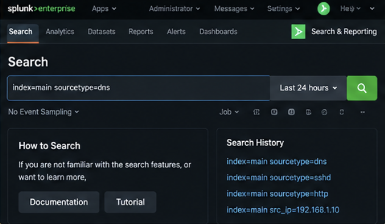
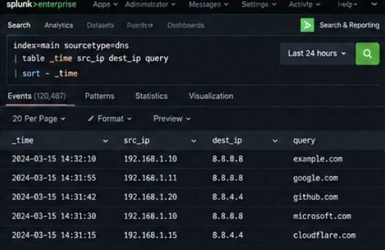
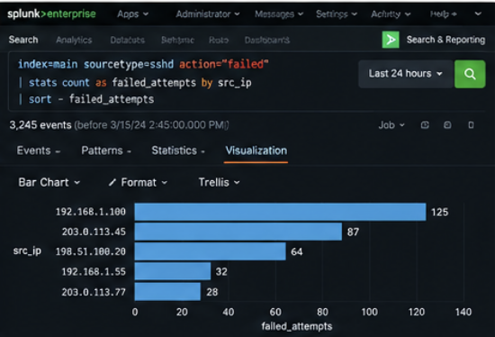
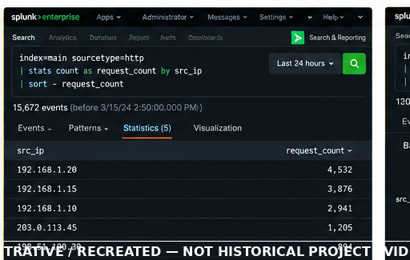
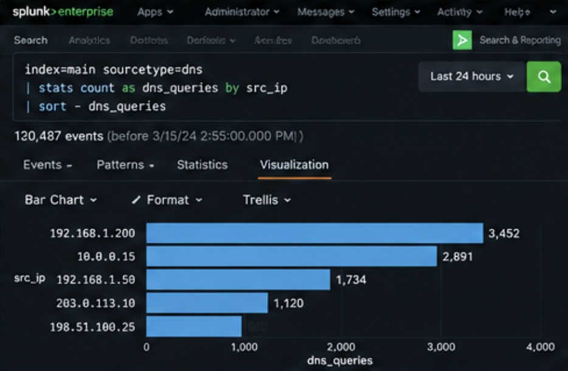
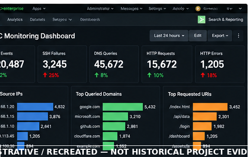
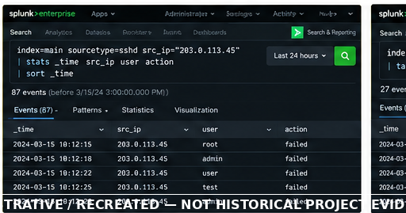
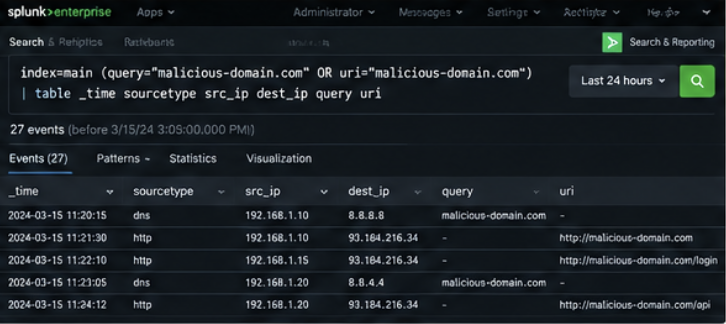
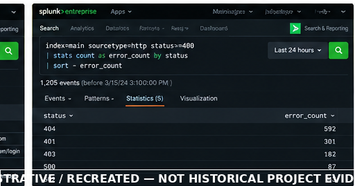

# Splunk SIEM – Security Log Analysis & Detection

A hands-on Security Information and Event Management (SIEM) project focused on using **Splunk** for security log analysis, threat detection, investigation, IOC identification, and SOC monitoring.

The project demonstrates the use of **Splunk Search Processing Language (SPL)** to investigate DNS, SSH, and HTTP activity and identify security-relevant patterns such as brute-force attempts, suspicious DNS behavior, abnormal HTTP traffic, and potential indicators of compromise.

---

## Table of Contents

- [Overview](#overview)
- [Objectives](#objectives)
- [Technologies](#technologies)
- [SIEM Investigation Workflow](#siem-investigation-workflow)
- [Log Sources](#log-sources)
- [DNS Log Analysis](#dns-log-analysis)
- [SSH Log Analysis](#ssh-log-analysis)
- [HTTP Log Analysis](#http-log-analysis)
- [Threat Detection Use Cases](#threat-detection-use-cases)
- [Brute-Force Detection](#brute-force-detection)
- [Suspicious DNS Detection](#suspicious-dns-detection)
- [Abnormal HTTP Traffic Detection](#abnormal-http-traffic-detection)
- [IOC Identification](#ioc-identification)
- [Security Dashboards](#security-dashboards)
- [Screenshots](#screenshots)
- [Investigation Workflow](#investigation-workflow)
- [SOC Analyst Perspective](#soc-analyst-perspective)
- [Detection Methodology](#detection-methodology)
- [Key Learning Outcomes](#key-learning-outcomes)
- [Future Improvements](#future-improvements)
- [Repository Structure](#repository-structure)
- [Lab Scope](#lab-scope)

---

# Overview

This project demonstrates a practical SIEM workflow using Splunk to analyze security-relevant logs and identify potentially suspicious activity.

The project focused on:

- Security log ingestion
- SPL-based investigation
- DNS analysis
- SSH authentication analysis
- HTTP traffic analysis
- Brute-force detection
- Suspicious DNS detection
- Abnormal HTTP traffic detection
- IOC identification
- Security dashboards
- SOC investigation workflows

The goal was to understand how a SOC analyst can use centralized security logs and SPL searches to detect, investigate, and document suspicious activity.

---

# Objectives

The main objectives of this project were to:

- Understand Splunk as a SIEM platform
- Analyze security logs using SPL
- Investigate DNS activity
- Investigate SSH authentication activity
- Investigate HTTP traffic
- Detect brute-force behavior
- Identify suspicious DNS activity
- Identify abnormal HTTP traffic
- Extract potential indicators of compromise
- Build security monitoring dashboards
- Practice SOC investigation workflows
- Develop a defensive security analysis mindset

---

# Technologies

| Technology | Purpose |
|---|---|
| Splunk | SIEM and security log analysis |
| SPL | Search, analysis, and detection |
| DNS Logs | DNS activity investigation |
| SSH Logs | Authentication and brute-force investigation |
| HTTP Logs | Web traffic investigation |
| SOC Methodology | Detection and incident investigation |

---

# SIEM Investigation Workflow

The project followed a general SIEM investigation workflow:

```text
                Security Logs
                     |
                     v
                Log Ingestion
                     |
                     v
                   Splunk
                     |
                     v
                 SPL Search
                     |
                     v
                 Log Analysis
                     |
                     v
              Suspicious Activity
                     |
                     v
                Evidence Review
                     |
                     v
                IOC Identification
                     |
                     v
                 Investigation
                     |
                     v
                 Documentation
```

---

# Log Sources

The project focused on three primary categories of security-relevant activity.

## DNS

DNS logs were analyzed to understand:

- Query activity
- Frequently queried domains
- Suspicious domain behavior
- Unusual DNS patterns
- Potential DNS-related indicators

---

## SSH

SSH logs were analyzed to investigate:

- Successful authentication
- Failed authentication
- Repeated authentication failures
- Source IP activity
- Potential brute-force behavior
- Authentication anomalies

---

## HTTP

HTTP logs were analyzed to investigate:

- HTTP requests
- Response codes
- Request patterns
- Abnormal traffic
- Potentially suspicious web activity
- Source and destination behavior

---

# DNS Log Analysis

DNS activity can provide useful information during security investigations because unusual domain-query behavior may indicate suspicious or compromised activity.

The analysis focused on identifying:

- High-volume DNS queries
- Repeated queries
- Unusual domains
- Query patterns
- Potentially suspicious DNS behavior

### Investigation Workflow

```text
DNS Logs
   |
   v
SPL Search
   |
   v
Query Analysis
   |
   v
Identify Unusual Patterns
   |
   v
Investigate Domains
   |
   v
IOC Identification
```

Detailed DNS SPL examples are maintained under:

```text
spl/dns/
```

---

# SSH Log Analysis

SSH authentication logs can provide valuable evidence during authentication-related investigations.

The analysis focused on:

- Successful logins
- Failed login attempts
- Repeated failures
- Source IP addresses
- Authentication patterns
- Potential brute-force behavior

### Investigation Workflow

```text
SSH Logs
   |
   v
Authentication Analysis
   |
   v
Failed Login Detection
   |
   v
Source IP Analysis
   |
   v
Repeated Attempts
   |
   v
Brute-Force Investigation
```

Detailed SSH SPL examples are maintained under:

```text
spl/ssh/
```

---

# HTTP Log Analysis

HTTP logs were analyzed to identify unusual web traffic and potentially suspicious request behavior.

The analysis considered:

- HTTP request activity
- Response status codes
- Request frequency
- Source IP behavior
- Unusual traffic patterns
- Potentially suspicious requests

### Investigation Workflow

```text
HTTP Logs
   |
   v
Request Analysis
   |
   v
Traffic Pattern Analysis
   |
   v
Identify Anomalies
   |
   v
Investigate Source Activity
   |
   v
Potential IOC Identification
```

Detailed HTTP SPL examples are maintained under:

```text
spl/http/
```

---

# Threat Detection Use Cases

The project focused on several practical security detection use cases.

## Detection Use Cases

| Use Case | Objective |
|---|---|
| SSH Brute Force | Identify repeated authentication failures |
| Suspicious DNS | Identify unusual DNS activity |
| Abnormal HTTP | Identify unusual web traffic |
| IOC Detection | Identify potentially relevant indicators |
| Authentication Analysis | Investigate login activity |

Detection documentation is maintained under:

```text
detections/
```

---

# Brute-Force Detection

Repeated authentication failures from the same source can indicate potential brute-force activity.

The investigation workflow was:

```text
SSH Authentication Logs
          |
          v
      Failed Logins
          |
          v
     Group by Source
          |
          v
     Count Attempts
          |
          v
Identify High-Frequency Sources
          |
          v
    Investigate Activity
```

The analysis considered:

- Source IP
- Number of failed attempts
- Time range
- Target account
- Authentication outcome
- Related successful authentication

The corresponding detection documentation is available under:

```text
detections/brute-force.md
```

---

# Suspicious DNS Detection

Suspicious DNS behavior can be identified by analyzing query patterns and unusual domain activity.

The investigation considered:

- Query frequency
- Domain patterns
- Repeated queries
- Unusual domains
- Source systems
- Time-based behavior

### Workflow

```text
DNS Queries
    |
    v
Frequency Analysis
    |
    v
Domain Analysis
    |
    v
Identify Anomalies
    |
    v
Investigate Source
    |
    v
IOC Analysis
```

The corresponding documentation is available under:

```text
detections/suspicious-dns.md
```

---

# Abnormal HTTP Traffic Detection

HTTP traffic was analyzed for patterns that could indicate unusual or suspicious behavior.

The analysis considered:

- Request frequency
- HTTP response codes
- Source activity
- Request patterns
- Unusual traffic behavior

### Workflow

```text
HTTP Traffic
     |
     v
Request Analysis
     |
     v
Response Analysis
     |
     v
Pattern Identification
     |
     v
Anomaly Investigation
     |
     v
IOC Analysis
```

The corresponding documentation is available under:

```text
detections/abnormal-http.md
```

---

# IOC Identification

Potential indicators of compromise were identified from security logs during investigation.

Potential IOC categories include:

- IP addresses
- Domains
- URLs
- File hashes
- Usernames
- Suspicious requests
- Authentication sources
- Other security-relevant artifacts

The IOC investigation workflow was:

```text
Security Event
      |
      v
Log Analysis
      |
      v
Identify Relevant Artifacts
      |
      v
Extract Potential IOCs
      |
      v
Validate Evidence
      |
      v
Document IOC
```

Potential indicators should be validated using supporting evidence before being treated as confirmed malicious indicators.

---

# Security Dashboards

Dashboards were created to support security monitoring and SOC investigations.

The dashboard concept was to provide visibility into:

- Authentication activity
- Failed login attempts
- DNS activity
- HTTP traffic
- Suspicious events
- Potential indicators
- Detection activity

### Dashboard Workflow

```text
Security Logs
     |
     v
   Splunk
     |
     v
  SPL Searches
     |
     v
  Detection
     |
     v
Dashboard Panels
     |
     v
SOC Monitoring
```

Dashboard documentation is maintained under:

```text
dashboards/
```

---

# Screenshots

The following screenshots provide visual references for the Splunk SIEM analysis, detection, investigation, and dashboard workflows documented in this project.

> **Note:** These screenshots are illustrative/recreated visuals and are not original historical evidence from the previous lab environment.

## Splunk Search Interface



---

## DNS SPL Analysis



---

## SSH Brute-Force Detection



---

## HTTP Traffic Analysis



---

## Suspicious DNS Detection



---

## Splunk SOC Monitoring Dashboard



---

## SSH Investigation



---

## IOC Investigation



---

## HTTP Error Analysis



---

For additional information about the screenshot references, see the [Screenshots Documentation](./screenshots/README.md).

---

# Investigation Workflow

The investigation process followed a structured SOC methodology.

```text
Alert / Suspicious Activity
            |
            v
        Initial Triage
            |
            v
      Search Relevant Logs
            |
            v
        Analyze Activity
            |
            v
        Correlate Evidence
            |
            v
        Identify IOCs
            |
            v
        Scope Activity
            |
            v
       Determine Findings
            |
            v
         Documentation
```

---

## Initial Triage

The initial investigation focused on understanding:

- What happened?
- When did it happen?
- Which source was involved?
- Which destination or service was affected?
- What logs contain supporting evidence?

---

## Evidence Analysis

Relevant events were analyzed using SPL to understand the activity and identify patterns.

Evidence could include:

- Source IP addresses
- Destination information
- Authentication events
- DNS queries
- HTTP requests
- Response codes
- Event timestamps

---

## Correlation

Different events can be correlated to develop a broader understanding of an incident.

For example:

```text
SSH Authentication
        |
        v
Source IP Identified
        |
        v
Related Network Activity
        |
        v
DNS / HTTP Evidence
        |
        v
IOC Identification
        |
        v
Incident Investigation
```

---

# SOC Analyst Perspective

A SIEM is not only a place to search logs.

A SOC analyst uses a SIEM to:

- Monitor security events
- Search and filter telemetry
- Identify suspicious patterns
- Investigate alerts
- Correlate evidence
- Identify IOCs
- Determine incident scope
- Support incident response
- Document findings

The project demonstrates this workflow using Splunk and SPL.

---

# Detection Methodology

The detection approach was based on identifying patterns within security logs.

The general methodology was:

```text
Understand Log Source
        |
        v
Identify Relevant Fields
        |
        v
Build SPL Search
        |
        v
Filter Noise
        |
        v
Identify Suspicious Pattern
        |
        v
Validate Evidence
        |
        v
Create Detection
        |
        v
Visualize Results
```

This approach helps transform raw security logs into actionable security information.

---

# SPL Investigation

Splunk Search Processing Language was used as the primary investigation mechanism.

The SPL workflow included concepts such as:

- Searching events
- Filtering results
- Selecting relevant fields
- Aggregating events
- Counting activity
- Grouping events
- Sorting results
- Time-based analysis
- Identifying unusual patterns

Detailed SPL searches are organized under:

```text
spl/
├── dns/
├── ssh/
├── http/
└── detection/
```

---

# Key Learning Outcomes

This project provided practical experience with:

- Splunk SIEM
- SPL
- Security log analysis
- DNS investigation
- SSH authentication analysis
- HTTP traffic analysis
- Brute-force detection
- Suspicious DNS detection
- HTTP anomaly detection
- IOC identification
- Security dashboards
- SOC investigation workflows
- Evidence correlation
- Detection methodology

---

# Future Improvements

Possible future improvements include:

- Integration with additional log sources
- Automated alerting
- More advanced SPL detections
- Risk-based alert prioritization
- Threat intelligence enrichment
- Automated IOC enrichment
- Additional dashboards
- MITRE ATT&CK mapping
- Detection rule tuning
- Automated investigation workflows
- Integration with SOAR platforms

---

# Repository Structure

```text
splunk-siem-security-log-analysis/
│
├── README.md
├── LICENSE
├── .gitignore
│
├── spl/
│   ├── dns/
│   ├── ssh/
│   ├── http/
│   └── detection/
│
├── detections/
│   ├── brute-force.md
│   ├── suspicious-dns.md
│   ├── abnormal-http.md
│   └── ioc-detection.md
│
├── dashboards/
│   └── README.md
│
├── investigations/
│   ├── dns-investigation.md
│   ├── ssh-investigation.md
│   └── http-investigation.md
│
├── sample-data/
│   └── README.md
│
├── screenshots/
│   ├── README.md
│   ├── splunk-search-interface.png
│   ├── dns-spl-search.png
│   ├── ssh-bruteforce-detection.png
│   ├── http-analysis.png
│   ├── suspicious-dns-detection.png
│   ├── splunk-soc-dashboard.png
│   ├── ssh-investigation.png
│   ├── ioc-investigation.png
│   └── http-error-analysis.png
│
└── docs/
    └── lessons-learned.md
```

---

# Lab Scope

This project was developed as a controlled cybersecurity learning environment for practicing SIEM-based security monitoring and investigation.

The project focuses on defensive security analysis using Splunk and does not represent a production enterprise SIEM deployment.

Security activity and investigation exercises were intended for controlled lab environments.

---

# Final Project Summary

The project demonstrates how Splunk can be used to transform security logs into actionable investigation data.

```text
                 Security Logs
                       |
                       v
                     Splunk
                       |
                       v
                    SPL Search
                       |
                       v
                   Log Analysis
                       |
              +--------+--------+
              |        |        |
              v        v        v
             DNS      SSH      HTTP
              |        |        |
              +--------+--------+
                       |
                       v
                 Threat Detection
                       |
                       v
                   IOC Analysis
                       |
                       v
                  Investigation
                       |
                       v
                   Dashboards
                       |
                       v
                  SOC Monitoring
```

The project demonstrates the complete SIEM workflow:

**Collect → Search → Analyze → Detect → Correlate → Investigate → Document**

---

## Detailed Documentation

Additional documentation is available throughout the repository:

- [SPL Queries](./spl/)
- [Detection Use Cases](./detections/)
- [Dashboards](./dashboards/README.md)
- [Investigations](./investigations/)
- [Sample Data](./sample-data/README.md)
- [Screenshots](./screenshots/README.md)
- [Lessons Learned](./docs/lessons-learned.md)
